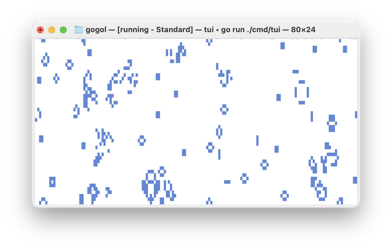
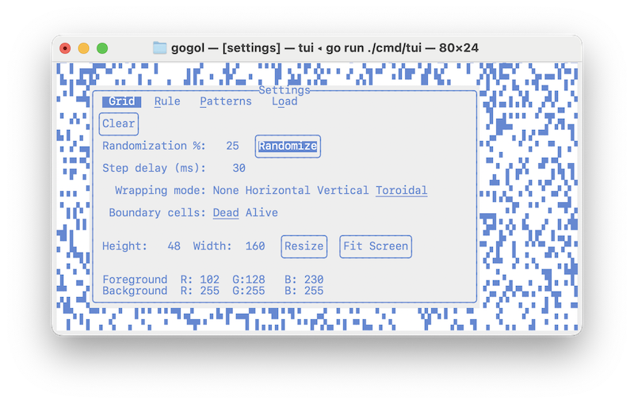
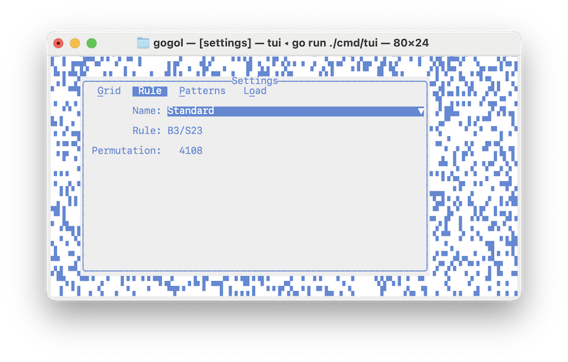
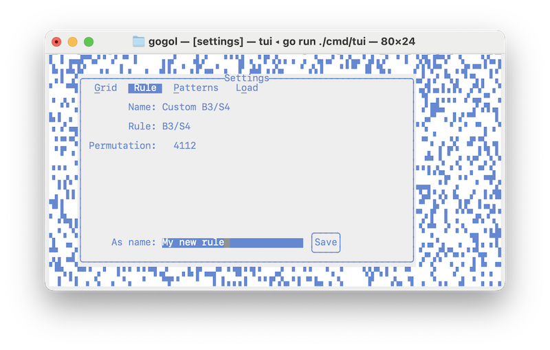
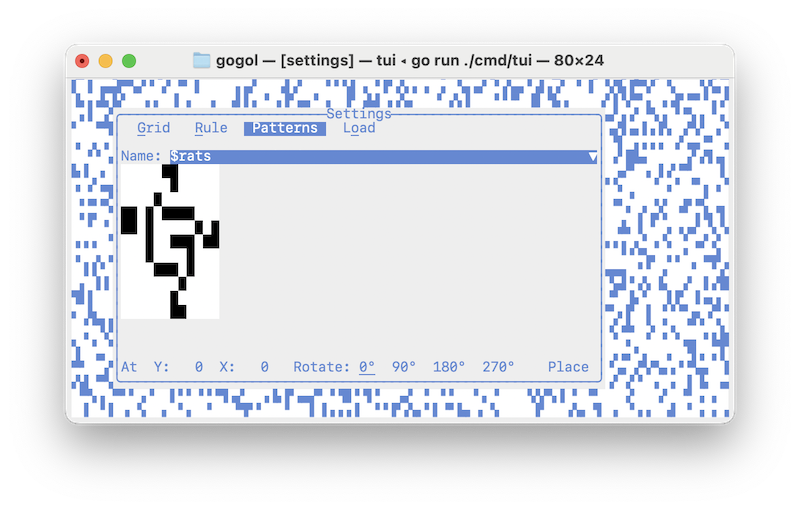
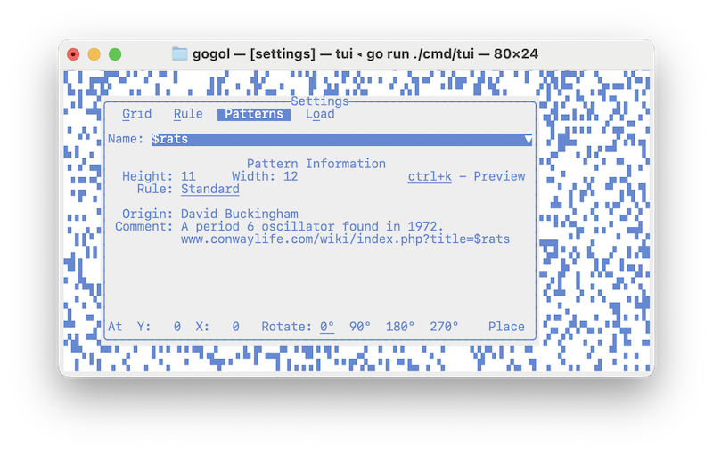
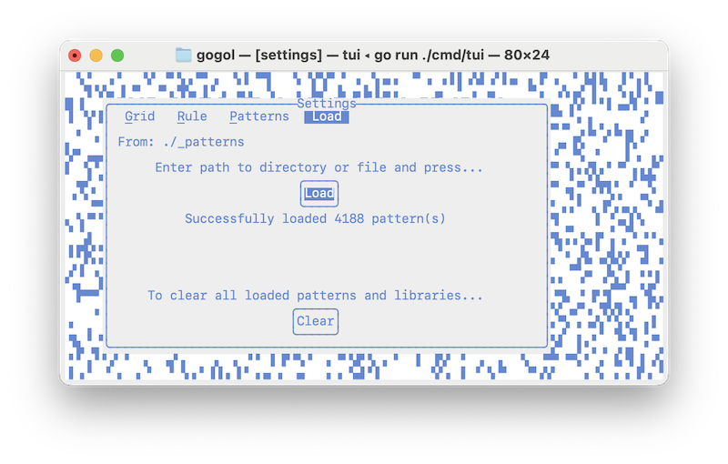
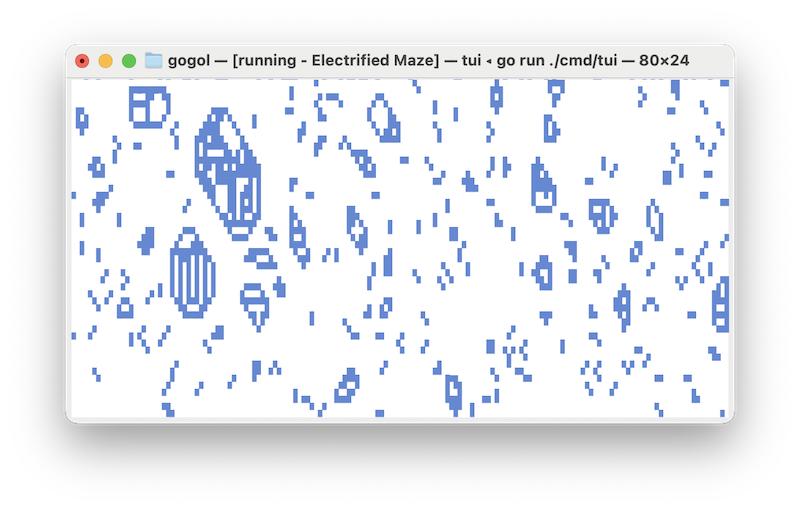
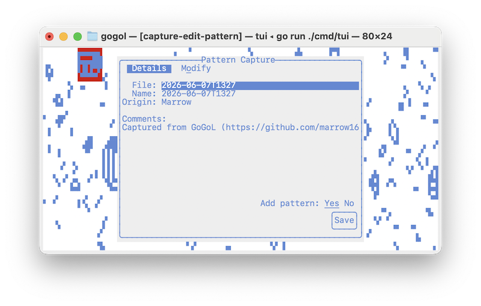
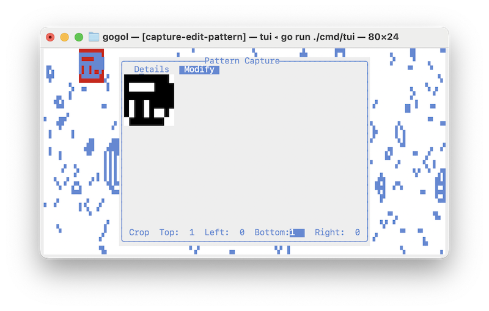

# gogol

Game Of Life implementation in Go.

## Features

* Easy-to-use terminal UI (TUI)
* Fast rendering and simulation (~100 FPS)
* Mouse and keyboard support
* Full control over grid state
* Standard and custom Life rules
* Built-in pattern library
* Load individual RLE patterns and/or entire libraries
* Pattern preview and metadata viewer
* Pattern placement, rotation and positioning
* Pattern capture from a running simulation
* Interactive pattern editor (cropping and cleanup; metadata editing; save as RLE)

## Running

(requires Go 1.26 installed)

TUI (terminal UI):
```
go run ./cmd/tui
```

## Screenshots












