# gogol

Game Of Life implementation in Go.

## Features

* Easy-to-use GUI
* Fast rendering and simulation
* Step ahead (steps the simulation ahead without rendering)
* Snapshot current grid and revert back to snapshot
* Full control over grid settings
* Standard and custom Life rules
* Load individual RLE patterns and/or entire libraries
* Pattern preview and metadata viewer
* Pattern placement, rotation and positioning
* Pattern capture from a simulation
  * Interactive pattern editor (cropping and cleanup; metadata editing; save as RLE)
  * Identification against loaded patterns library
* Grid recipes - JSON files to create initial grid (see [README](recipes/README.md))
* Meta rules

## GUI Builds

See [_builds](https://github.com/marrow16/gogol/tree/main/_builds/gui)

## Screenshots GUI

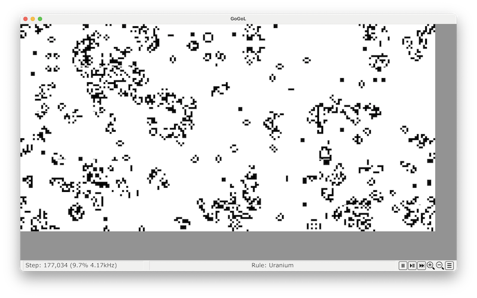
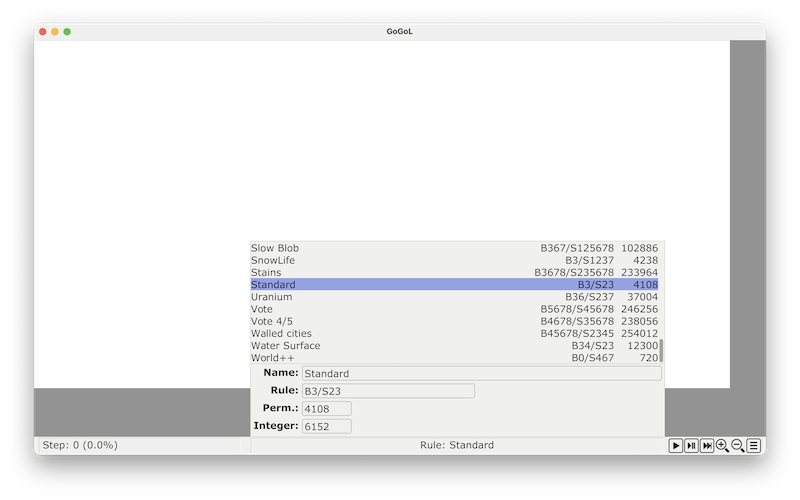
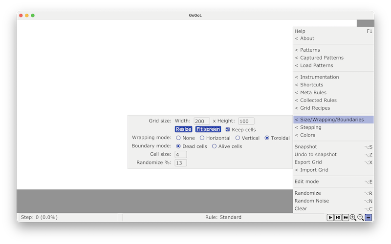
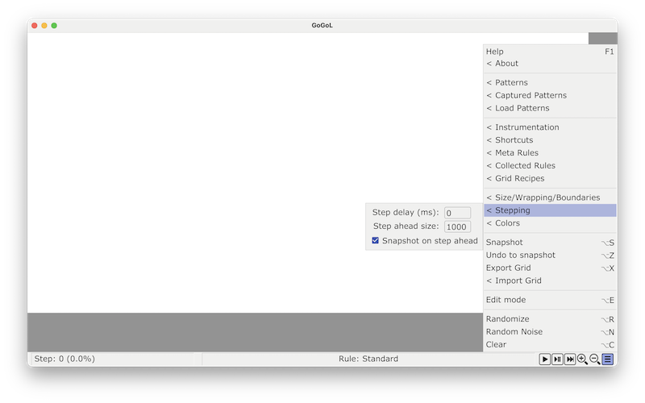
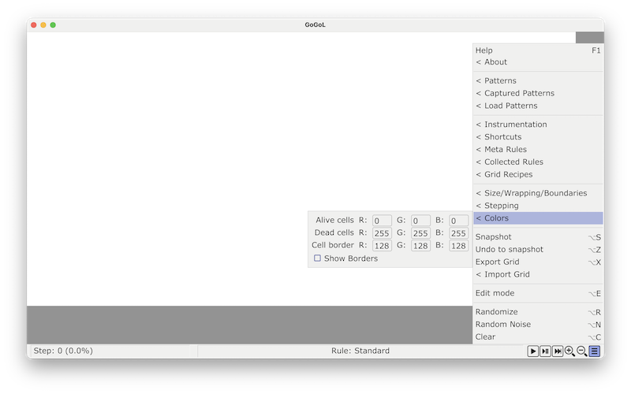
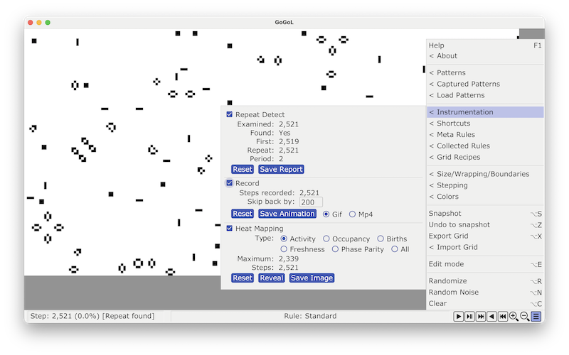
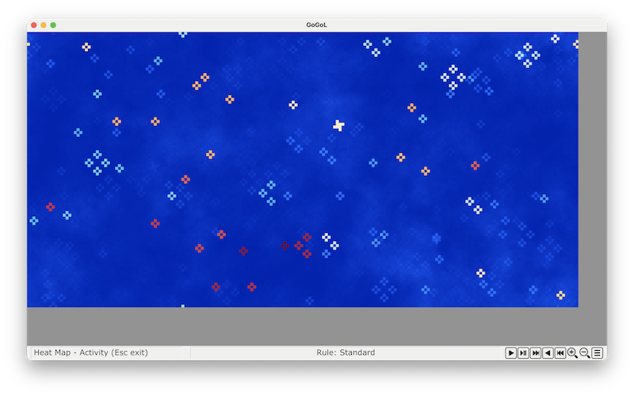
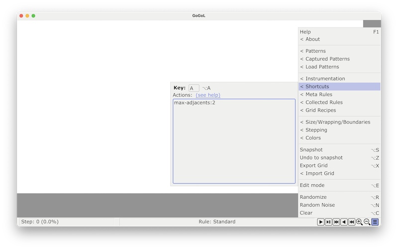
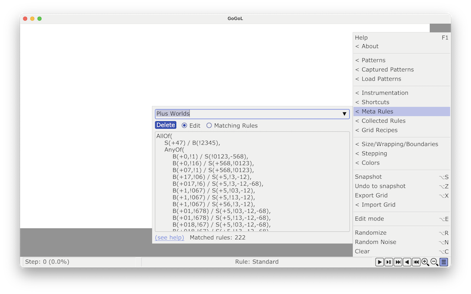
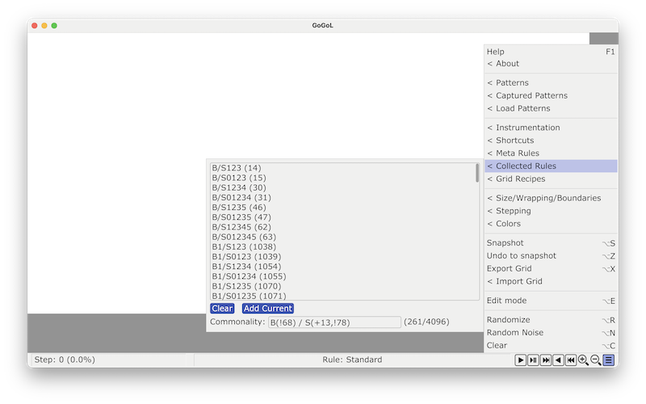
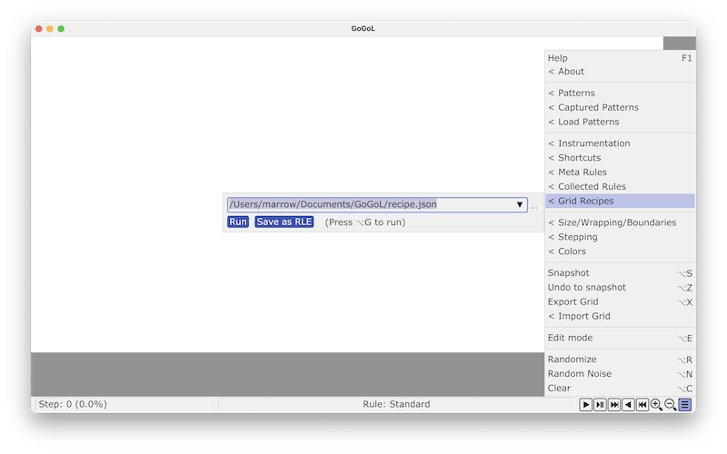
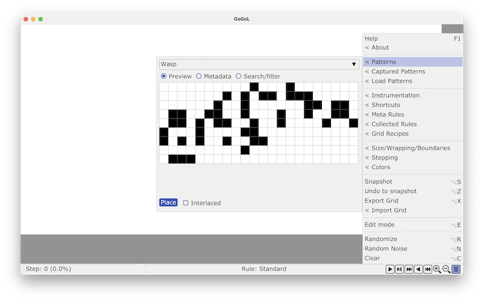
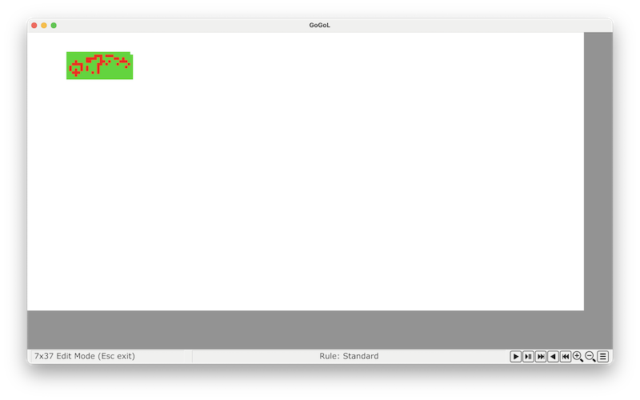
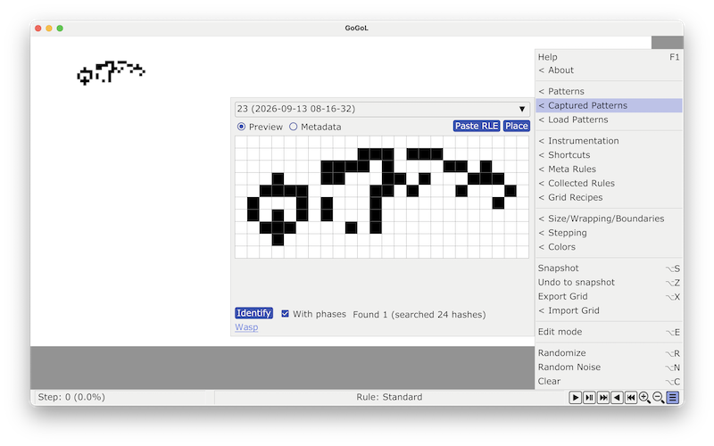
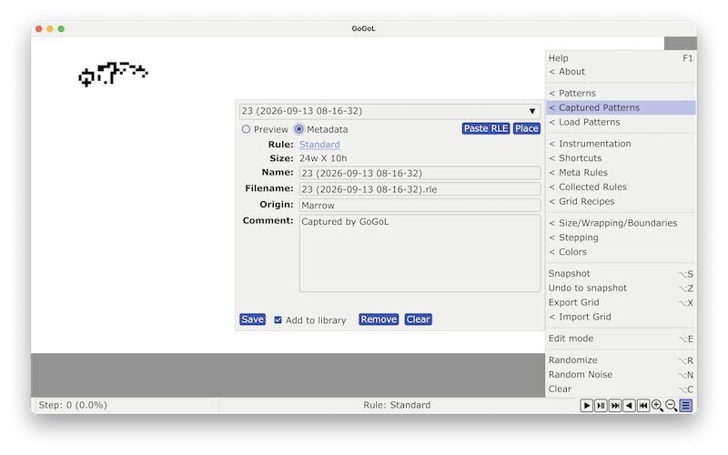
